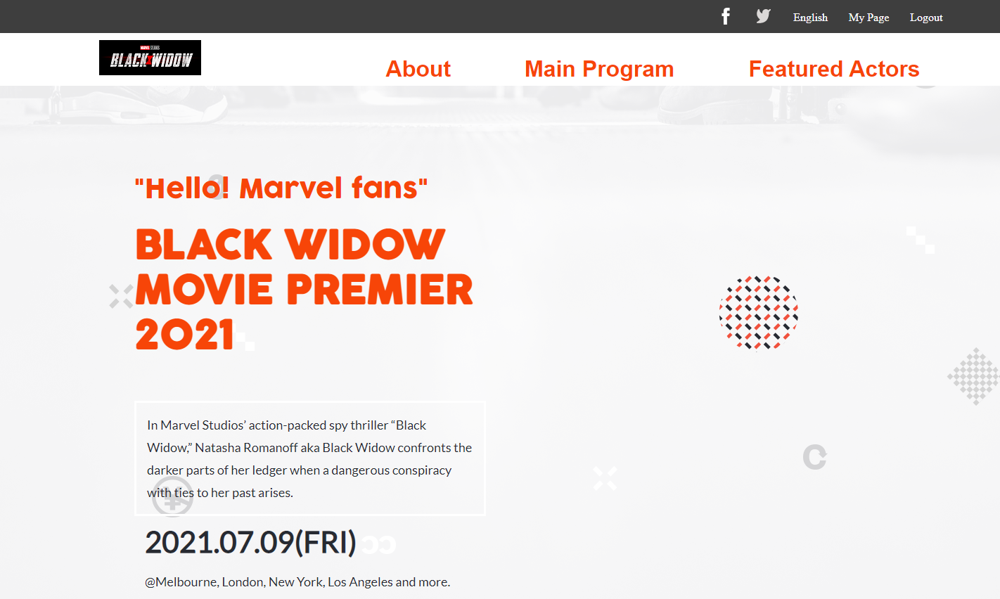

# Capstone Project - Microverse Module 1

> My project name is "Movie-premier"

This project is to apply the tools/concepts we have learned in module (HTML/CSS/JavaScript). 

[Portolio Live Demo](https://herokudev.github.io/Movie-premier/)

## Built With
- HTML, CSS, JS
- Linters, Node.js, Git, Flexbox

## Authors (Github: Herokudev)
Herbert Orellana

- GitHub: [@herokudev](https://github.com/herokudev)
- LinkedIn: [LinkedIn](https://linkedin.com/in/armando-orellana-a0b50b34)

## Acknowledgements
- [Cindy Shin](https://www.behance.net/adagio07) 
- [Design Guideline](https://www.behance.net/adagio07) 

## 🤝 Contributing
Contributions, issues, and feature requests are welcome!

Show your support
Give a ⭐️ if you like this project!

## 📝 License 
This project is MIT licensed.